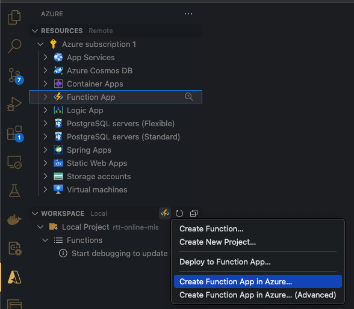
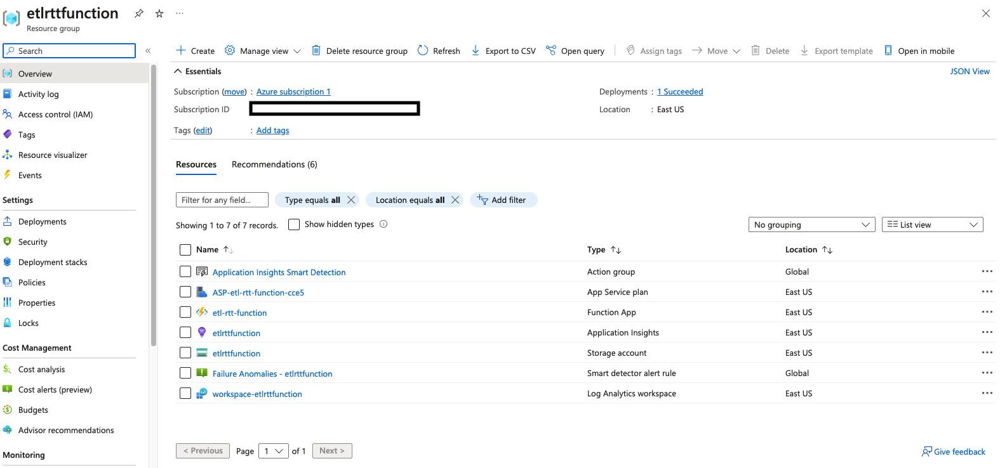
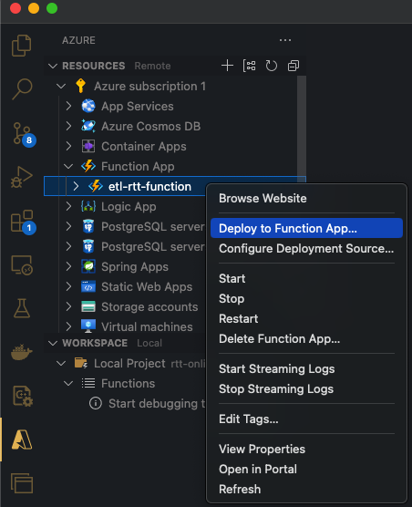

# MIS ProBono

## Introduction
As part of the MIS ProBono project we have learned the Reach to Teach team is looking for a solution that would help them and government officials of different states to make better decisions and have a more thorough understanding of what is happening in the "field". For example, common queries are:
- "How many schools are there in a given state?"
- "How many boys and girls are in a particular school?"
- "How many boys and girls are in a particular grade?"
- etc

After several discussions with Reach to Teach team it became clear that while initially we were talking about dashboards and visualizations, it became apparent that they are looking for help in building a Data Management solution. As far as as we were able to observe, the data is currently stored in Excel files and is not easily accessible. The goal of this project is to build a solution that would allow Reach to Teach team to easily access the data and answer the questions they have.

## Data Management platform - WIP
While talking to Reach to Teach team we have identified that they are thinking in terms of use cases. One of the first things when trying to use any system is to be able to provide an organization mode that would make sense for the users of the system. Reach to Teach team have access to PowerBI and after several explorations we have decided to use PowerBI as a platform for the Data Management solution. The main reason for this is that PowerBI is already used by Reach to Teach team, they have access to it at no additional cost and they are familiar with it.

A few assumptions that we are making regarding Reach to Teach team access to Microsoft technologies:
- Access to Active Directory - this will be used for user and access management
- Access to PowerBI Service - this will be used for data upload, reports, dashboards, etc

At a very high level any use case would go through the following flow:
1. Create a PowerBI workspace - a workspace is a container for datasets, tables, dashboards, reports for a particular use case. One nice feature of PowerBI workspaces is that it allows you to assign roles to users and control who has access to the workspace. The assumption here is that we already know the users and roles.
2. Create a semantic model aka datasets and tables - to be able to make sense of the data that has to be analyzed it is necessary to create a semantic model. A semantic model would consist of one or more datasets along with the associated tables. An important step at this stage is identifying which tables are dimension/lookup table and which ones are fact tables. Ideally the semantic model should be created and stored in a format that is usable from a Git repo. For example using something like YAML or JSON. This would allow us to track changes to the semantic model and also allow us to use the same semantic model in different workspaces.
3. Create input, output, error folders - these input folder will be used to store the raw input Excel/CSV files, the output folder will be used to store files in the standard format and the error folder will be used to store files that have errors and might need reprocessing. To make things easier these folder names should be derived from the workspace name, so it is easier to identify which folders belong to which workspace.
4. Create/reuse ETL jobs - having the semantic model and the input, output, error folders it is possible to create ETL jobs that would read the input files, transform them, store them in the output folder and then upload data to PowerBI. The ETL jobs should be created in a way that they can be easily reused in different workspaces. For example, the ETL jobs should be stored in a Git repo and should be parameterized so that they can be easily reused in different workspaces.
5. Create PowerBI reports/dashboards/apps - once the data flow has been configured and data is continuously flowing into PowerBI, analysts can create reports, dashboards, etc for final consumption.

### Use case management in PowerBI

#### Workspace creation
As it was mentioned previously, a use cases will be mapped to a PowerBI workspaces. To make sure that everything is properly configured and secured from PowerBI perspective the use case project owner should ensure that the following steps are completed:
1. Use case has a PowerBI workspace
2. Use case has an Active Directory user group
3. User group is assigned to the workspace
4. Users within the user group are assigned to the workspace with the appropriate role

#### Semantic model creation
To make sense of data, a semantic model is a must. While it might sound like a lot of work, a semantic model can be easily derived from the Excel files that will be uploaded for a particular use case.

The whole process of creating a semantic model can be broken down into the following steps:
1. Use case is using an Excel file that self contained and using a single sheet? - if the uploaded file has all the data, then the semantic model can be as simple as creating a dataset with a table that contains the Excel sheet columns. It should be noted that ideally the semantic model table columns should follow some standard naming convention. For example, if the Excel sheet has a column named "School Name", then the semantic model table column should be named "school_name". This will make it easier to reference the columns in the semantic model.
2. Use case is using an Excel file that is self contained and using multiple sheets? - if the uploaded file has all the data and it contains multiple sheets, then the semantic model should have a dataset with multiple tables. Each table should correspond to a sheet in the Excel file. The table columns should follow the same naming convention as in the previous step.
3. Use case is using multiple files? - if the use case is using multiple files, then the semantic model should can contain one or more datasets and depending on Excel file structure like one or more sheets each dataset can contain one or more tables. The table columns should follow the same naming convention as in step 1. In general when dealing with a use case based on multiple files each file should be analyzed and a decision should be made whether it makes sense to have a single dataset with multiple tables or multiple datasets with one or more tables. The decision should be based on the data and the use case requirements.

While working on semantic model it is critical to make sure that the model is explicit about which tables a dimension/lookup tables and which tables are fact tables. This should help the ETL jobs to properly process the data and avoid unnecessary work when dealing with dimension/lookup tables.

While not strictly related to semantic model creation in PowerBI, we should make sure that the mapping from Excel files sheets to semantic model dataset name and table columns is stored in a place that can be easily accessed and used by the ETL jobs.

#### ETL jobs creation
Python is the language of choice for ETL jobs. The main reason for this is that Python is a very popular language and RTT team is already familiar with it. In addition, Python has a very rich ecosystem of libraries that can be used for data processing. For example, `Pandas`` is a very popular library that can be used for data processing and it has a very rich set of features that can be used for data processing, including reading Excel files, CSV files, etc.

The ETL jobs will be event driven. A typical event job would look like this:
1. A new file is uploaded to the input folder
2. The ETL job is triggered
3. The ETL job reads the file and transforms it
4. The ETL job stores the transformed file in the output folder
5. The ETL job uploads the transformed file to PowerBI

It should be noted that the "transform" step is loosely defined. The transformation can be as simple as renaming columns or as complex as joining multiple tables and creating a new table. The transformation step should be defined based on the semantic model and the data that is available in the input file.

## Recommendations
While in this document we have talked about "input" and "output" folders, "input" and "output" files, it should be noted that these are used in a loose sense. The recommendation is to rely on Azure Cloud services to store the files. For example, Azure Blob Storage can be used to store the files. The main reason for this is that Azure Blob Storage is a very cost effective way to store files and it is very easy to integrate with it. For example, Azure Blob Storage can be easily integrated with PowerBI and it can be used as a data source for PowerBI reports and dashboards.

Also the ETL jobs can be easily deployed as Azure Functions and they can be triggered by different events, like a new file has been uploaded, updated, removed, etc. This will allow us to have a solution that will scale based on the load and will be very cost effective.

## Azure Function App Setup
This section serves as a guidebook on how to use the code in this repository and deploy it to an Azure Function that will be able to run the flow described at [ETL Jobs section](#etl-jobs-creation).

### Prerequisites
* Working account on [Azure](https://portal.azure.com)
* [Visual Studio Code](https://code.visualstudio.com/download)
* [Azure Functions](https://marketplace.visualstudio.com/items?itemName=ms-azuretools.vscode-azurefunctions) extension for Visual Studio Code
* Clone the repo locally

### Creating an Azure Function
After installing VSCode and the necessary extensions, open the project in VSCode, and log into your Azure account using the Azure extension from VSCode.
At this point, you should be able to see a left pane similar to the one below:

Use the `Create Function App in Azure...` option from the pane and follow the instructions: provide a name like `etl-rtt-function` or something similar, python runtime (Python 3.9 has been tested for this) and a region (e.g. US EAST).

After the creation process finishes, you should be able to see your newly created resource group in Azure, like in the figure below. A couple of resources that are necessary in order for the Azure Function App to work, please validate you have the following:
* an App Service Plan
* an Application Insights
* a Storage Account
* a Function App

### Deploying Python code to Azure Function

The Function App resource and its dependencies should be created in Azure at this stage. The next step is deploying the Python code to the Azure Function App. This can be done from VSCode as well. Using the same extension, use `Resource` tab from the left panel to select the function app that we've just created previously. Right click on it an use the `Deploy to Function App...` option to deploy the code. Use the figure below for reference:

If everything runs smoothly, a success prompt should appear in VS Code.

### Testing the Function App
At this point, we have managed to both create the Function App resource in Azure, as well as deploy the Python code to that Function.

The last step we need to do is to test it.

For some context, the Function we have just deployed in the previous steps is configured to trigger execution when a blob (generic term for a data e.g. a file) is uploaded in a certain blob container. When an Excel file is uploaded in the container `inputcontainer`, the Function is triggered, executes (reads and processes the excel file that was uploaded) and writes the resulting Excel file in another container `outputcontainer`.

We first need to create those two container needed for input and output data.
In order to do this, we visit the Storage Accounts page in Azure Portal, and find the Storage Account that was created as part of [this stage](#creating-an-azure-function). It should have the same name as the one specified during the creation step (e.g. `etlrttfunction`). Access that Storage Account and create the two needed containers. Use the figure below for reference:

After having setup the needed containers, the only thing left to do is to use the demo data to trigger the Function and see how it works.
In the Azure Portal UI, go to the `inputcontainer` blob container we have just created, and click on `Upload`. Then, either Drag and Drop or browse to the file `test-data/use-case.xlsx`, and upload it. 

After the upload is complete, it will take a while for the Function to be triggered and to finish executing (about 1-2 minutes). After those few minutes pass, check the `outputcontainer` for any files there. If the Function executes successfully, a slightly transformed version of the original excel file should appear there.

> [!WARNING]  
> This code is for demo purposes only and not ready for production use.

> [!NOTE]  
> The Function code is only a proof-of-concept and does not peform any complex processing of the excel file besides filtering of a certain column. We advise that RTT should update the transformation code according to their needs / use-cases in order to sanitize and standardize the data in order to reach a desired output file.
